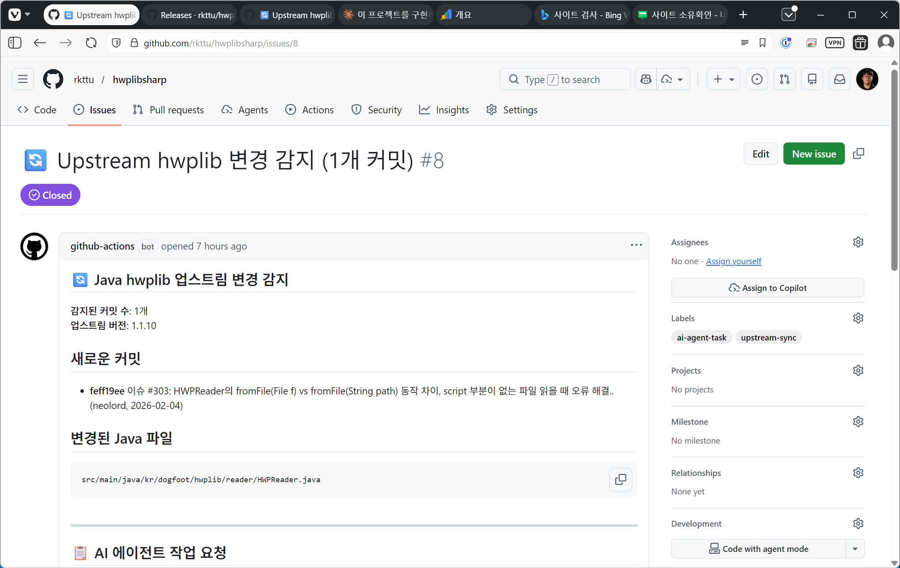

# AI 시대의 오픈소스 기여: HwpLibSharp 포팅 프로젝트에서 배운 것들

Microsoft MVP로 활동한 지 어느덧 17년이 되었습니다. 그동안 .NET 커뮤니티에서 가장 많이 받은 질문 중 하나가 "C#으로 HWP 파일을 어떻게 다루나요?"였습니다. 한글과컴퓨터의 공식 라이브러리는 Windows와 COM 기반이어서, 크로스 플랫폼 .NET 환경에서는 사실상 해법이 없었습니다.

그러다 [@neolord0](https://github.com/neolord0)님의 `hwplib`을 발견했습니다. Java로 작성된, 순수하게 HWP 파일 포맷을 파싱하는 오픈소스 라이브러리였습니다. "이걸 .NET으로 옮기면 커뮤니티에 도움이 되겠다"는 생각이 바로 들었지만, 쉬운 일은 아니었습니다. 코드베이스가 방대한 데다 지금도 계속 업데이트되고 있었으니까요.

그러던 중 2026년, 저는 AI 코딩 어시스턴트와 함께 이 작업을 시작했습니다.

## 일회성 포팅이 아닌 '동기화'

얼핏 생각하면 HWP 파일은 자주 변하는 포맷은 아니기에 한 번만 포팅하고 나면 더 이상 손댈 일이 없지 않는가 하는 예상을 하기 쉽습니다. 그러나 모든 기술은 계속 변화하며, 원본 프로젝트가 여전히 활발하게 관리되고 있는 것은 물론, 닷넷 기술 자체도 변화하기에 일회성 작업으로는 부족하다는 것을요.

전통적인 포크(fork)는 시간이 지나면 원본과 점점 멀어집니다. 결국 "우리 버전"과 "원본 버전"이 각자의 길을 가게 되죠. 당연한 수순이지만, 그럼에도 저는 다른 접근을 택했습니다. 단순한 포크가 아니라, **원본과 함께 살아 숨 쉬는 "이식된 구현체(Ported Implementation)"** 라는 정체성을 명확히 하기로 마음먹었습니다.

```text
원본 프로젝트: hwplib (Java)
       ↓ 주기적 동기화
포팅 프로젝트: HwpLibSharp (C#)
       ↓ .NET 특화 개선
생태계 확장
```

그래서 README에도 이렇게 적어두었습니다.

> "본 프로젝트의 의사결정 및 판단 우선권은 원본 프로젝트의 작성자인 @neolord0 님의 의사를 우선으로 합니다."

예의를 차리기 위해 쓴 문장이 아닙니다. 두 프로젝트가 장기적으로 공존하려면, 누가 방향을 결정하는지 처음부터 명확해야 한다고 판단했기 때문입니다.

## AI와 함께한 포팅 작업

솔직히 말해, AI 코딩 어시스턴트 없이 이 프로젝트를 진행했다면 초기 포팅에만 6개월 이상이 걸렸을 겁니다. 업스트림 동기화는 아예 엄두도 못 냈을 것이고, 결국 방치된 "또 다른 레거시"가 되었겠죠.

그러나 AI와 함께 일하면서 전혀 다른 방식이 가능해졌습니다.

### AI가 잘한 것

문법 변환은 거의 완벽했습니다. Java의 getter/setter를 C# 프로퍼티로 바꾸고, 명명 규칙을 C# 컨벤션에 맞추고, null 체크를 Nullable 참조 형식으로 전환하는 작업은 대부분 자동화할 수 있었습니다.

라이브러리 대응도 AI의 도움이 컸습니다. Apache POI를 OpenMcdf로 교체할 때, "Java에서 이 라이브러리가 하는 역할을 .NET에서는 뭐로 대체할 수 있는가"를 빠르게 찾아주었습니다. 원본 프로젝트가 업데이트될 때마다 변경 사항을 추적하고 C# 버전에 반영하는 반복 작업에서도 휴먼 에러를 크게 줄여주었고요.

### Upstream 변경 사항 자동 추적

이 과정에서 특히 효과적이었던 것은, AI 에이전트를 활용한 **upstream 변경 사항 자동 추적** 방식이었습니다. 원본 hwplib 프로젝트에 새 커밋이 들어올 때마다, AI 에이전트가 변경된 Java 소스 파일과 대응하는 C# 소스 파일을 비교 분석하여 구현 상의 차이점을 찾아냅니다.

이 동기화를 체계적으로 관리하기 위해, 포팅된 모든 C# 소스 파일 첫 줄에 원본 Java 파일과의 대응 관계를 명시하는 힌트 헤더를 남겨두었습니다.

```csharp
// =====================================================================
// Java Original: kr/dogfoot/hwplib/util/compressors/Compressor.java
// Repository: https://github.com/neolord0/hwplib
// =====================================================================
```

이 헤더가 있으면 AI 에이전트가 "이 C# 파일의 원본은 Java 쪽 어느 파일이다"를 즉시 파악할 수 있습니다. upstream에서 `Compressor.java`가 변경되면, AI가 대응되는 C# 파일을 찾아 diff를 분석하고, 누락된 변경 사항이나 구현 차이를 리포트해 줍니다. 사람이 수백 개의 파일을 하나하나 대조할 필요 없이, AI가 "이 부분이 원본과 달라졌으니 확인이 필요하다"고 알려주는 방식입니다.



실제로 이 방식을 도입한 후, upstream 동기화에 걸리는 시간이 기존 대비 80% 이상 단축되었습니다. 이전에는 변경 로그를 읽고 관련 파일을 하나씩 찾아가며 수동으로 반영했다면, 이제는 AI가 변경 목록과 영향 범위를 자동으로 정리해 주니까요.

### AI가 못한 것

반면, HWP 파일의 Section-Paragraph-Control 구조, 각 컨트롤의 의미, 한글 문서만의 특성 같은 도메인 지식은 온전히 제 몫이었습니다. AI가 그럴듯하게 제안한 코드가 실제로 맞는지 검증하는 건 결국 사람이 해야 하는 일이니까요.

전략적 결정도 마찬가지였습니다. Native AOT를 지원할 것인가, Blazor WebAssembly에서 어떻게 동작하게 할 것인가, 어느 .NET 버전까지 지원할 것인가. 이런 판단에는 .NET 생태계 전반에 대한 이해와 실제 사용자 환경에 대한 감각이 필요합니다. 라이선스 문구, 원작자와의 관계 설정, 한국 개발자 커뮤니티의 맥락을 반영하는 작업도 AI가 초안을 잡아주면 제가 다듬는 방식으로 진행했습니다.

## .NET 생태계에 맞게 재설계하기

단순히 코드를 옮기는 것에서 그치지 않았습니다. .NET 개발자들이 자연스럽게 쓸 수 있도록 API를 원본 프로젝트의 철학과 의도를 해치지 않는 선에서 다듬는 작업도 필요했습니다.

```csharp
// Blazor WebAssembly 지원 (파일 시스템 없이 스트림으로)
var hwpFile = HWPReader.FromStream(memoryStream);

// Native AOT 호환, URL에서 비동기 로딩
var hwpFile = await HWPReader.FromUrlAsync(url);
```

이런 기능들은 원본 Java 버전에는 없습니다. 하지만 .NET 개발자라면 당연히 기대하는 것들이죠. 덕분에 Azure Functions에서 HWP를 처리하거나, Blazor로 브라우저에서 HWP를 렌더링하는 것도 가능해졌습니다.

재미있는 일도 있었습니다. Java 개발자들이 HwpLibSharp의 README를 보고 아이디어를 가져가서, 원본 프로젝트의 문서화에 기여하기도 했습니다. .NET 버전의 사용 예제가 Java 사용자들에게도 도움이 된 셈입니다.

특히 RAG(Retrieval-Augmented Generation) 용도로 HWP에서 텍스트를 추출하는 예제는 양쪽 커뮤니티에서 활발하게 논의되었습니다. AI가 HWP 문서를 이해하려면 어떤 형태의 텍스트를 뽑아야 하는가, 이 질문은 프로그래밍 언어 경계를 넘어서는 것이니까요.

## 코드를 옮기는 사람에서 큐레이터로

이 프로젝트를 진행하면서 제 역할 자체가 변화했음을 느꼈습니다. 처음에는 코드를 번역하는 사람이었지만, 이제는 **두 생태계를 연결하는 큐레이터**에 가깝습니다. 원본 프로젝트의 변경 사항을 모니터링하고, .NET 커뮤니티의 요구를 수집하며, 두 세계의 관행과 철학을 조율하고, 지속 가능한 동기화 프로세스를 설계하는 일입니다.

현재 HwpLibSharp는 .NET Framework 4.7.2부터 .NET 8까지 지원하며, 실제 정부·공공기관 프로젝트에서도 사용되고 있습니다. 하지만 단순한 지원 범위보다 더 의미 있는 것은, 이전에는 불가능했던 시나리오들이 열렸다는 점입니다.

- Azure Functions에서 서버리스로 HWP 처리
- Blazor WASM으로 브라우저 내 HWP 렌더링
- .NET MAUI 모바일 앱에서 HWP 읽기
- AI/LLM의 RAG 파이프라인에 HWP 문서 통합

## 이 프로젝트에서 배운 것들

**AI는 경험의 배율기다.** 17년간 쌓아온 .NET 경험이 AI를 통해 몇 배의 생산성으로 나타났습니다. 그 경험이 없었다면 AI에게 올바른 방향을 제시할 수도 없었을 겁니다. AI는 경험을 대체하는 게 아니라 증폭시킵니다.

**자동화의 경계를 알아야 한다.** 문법 변환, 패턴 적용, 반복 테스트는 자동화하되, 전략 결정이나 도메인 검증, 커뮤니티와의 관계는 사람이 직접 해야 합니다. 이 경계를 혼동하면 빠르게 잘못된 방향으로 갈 수 있습니다.

**포크(Fork)가 아닌 "Living Port"라는 개념.** 원본과 경쟁하지 않고, 공생하면서 각자의 생태계에 가치를 더하는 구조입니다. 오픈소스 기여의 새로운 형태가 될 수 있다고 생각합니다.

**기여는 코드 이상이다.** README 한 줄, 예제 하나가 누군가의 삽질 3일을 절약해 줍니다. 한국처럼 고유한 문서 포맷을 다루는 환경에서는 그 효과가 더 큽니다.

## 마치며

.NET을 좋아해서 커뮤니티를 만들었고, 17년간 유지해왔습니다. 그 과정에서 쌓인 경험과 네트워크가 이제 AI라는 도구를 만나 새로운 형태의 가치를 만들어내고 있습니다.

HwpLibSharp 프로젝트는 기술 전문성, 커뮤니티 기여, AI 시대의 개발 방법론 실험이 한데 섞인 작업이었습니다. AI가 시간을 벌어주었고, 그 시간으로 더 많은 사람들에게 도움이 될 수 있었습니다. 어쩌면 이것이 지금 시대의 오픈소스 기여 방식일지도 모르겠습니다.

---

**프로젝트 링크:**

- GitHub: [rkttu/HwpLibSharp](https://github.com/rkttu/libhwpsharp)
- NuGet: [HwpLibSharp](https://www.nuget.org/packages/HwpLibSharp/)
- 원본 프로젝트: [neolord0/hwplib](https://github.com/neolord0/hwplib)

프로젝트에 대한 피드백이나 기여는 언제든 환영합니다. [GitHub Issue](https://github.com/rkttu/libhwpsharp/issues)로 편하게 남겨주세요.
