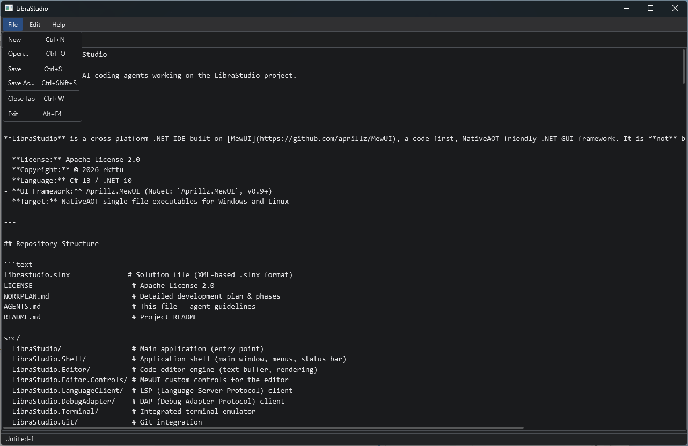

> 2026-02-08 — LibraStudio 개발기 #1

---

## 배경

### 왜 또 다른 .NET IDE인가

.NET 생태계에서 IDE 선택지는 사실 넓지 않습니다. Visual Studio는 강력하지만 Windows 전용이고, 커뮤니티 에디션조차 상업적 사용에 제약이 따릅니다. VS Code + C# Dev Kit 조합도 훌륭하지만, 핵심인 C# Dev Kit이 프로프라이어터리 라이선스라는 점은 변하지 않습니다. 결국 중요한 부분에서 벤더 락인이 발생하고, 그 위에 쌓은 도구 체인과 워크플로 전체가 특정 벤더의 의사 결정에 종속됩니다.

과거에는 SharpDevelop이 Windows에서, MonoDevelop(Xamarin Studio)이 크로스 플랫폼에서 그 자리를 채워줬습니다. 하지만 SharpDevelop은 2017년에 개발이 중단됐고, MonoDevelop은 Xamarin에 합병된 뒤 사실상 단독 IDE로서의 생명을 다했습니다. 그 이후로 최신 .NET(Core 이후) 개발 환경을 제대로 지원하는 **오픈소스이면서 리버럴 라이선스인 크로스 플랫폼 IDE**는 등장하지 않았습니다.

이 점이 늘 아쉬웠습니다. 그래서 LibraStudio를 시작했습니다. Electron이나 VS Code 기반이 아닌, 순수 .NET 네이티브 IDE를 목표로 합니다. 혼자서 Visual Studio 수준의 IDE를 만들겠다는 것은 당연히 아닙니다. 하지만 2026년에는 AI 기반 코드 에디터의 힘을 빌릴 수 있습니다. AI 에이전트에게 프레임워크 API를 탐색하게 하고, 보일러플레이트를 생성하게 하고, 반복적인 구현을 위임하면 — 한 사람이 감당할 수 있는 범위가 과거와는 완전히 다릅니다.

UI 프레임워크로는 [Aprillz.MewUI](https://github.com/aprillz/MewUI)를 사용합니다. NativeAOT 친화적이고, XAML 없이 C# 코드만으로 UI를 구성하는 가벼운 프레임워크입니다. 이 프레임워크는 저와 같이 한국의 대표 .NET 개발자 커뮤니티인 닷넷데브 (.NET Dev, <https://forum.dotnetdev.kr/>)에서 활동하는 송영재님의 오픈 소스 프로젝트입니다.

### AI가 모르는 신생 프레임워크라는 난관

MewUI는 완전히 새로운 컨셉의 신생 UI 프레임워크입니다. XAML 기반의 WPF나 AvaloniaUI와 달리, 순수 C# fluent API로 UI를 구성하는 독자적인 설계를 가지고 있습니다. 당연히 공식 문서가 풍부하지 않고, Stack Overflow에 관련 질문이 쌓여 있지도 않습니다.

여기에 .NET이라는 플랫폼 자체의 문제도 겹칩니다. 대형 언어 모델의 학습 데이터에서 .NET/C#은 JavaScript나 Python에 비해 상대적으로 학습 빈도가 낮습니다. 메이저 프레임워크인 WPF나 WinForms조차 가끔 부정확한 코드를 생성하는데, 학습 데이터에 거의 포함되어 있지 않을 MewUI의 API를 정확히 맞출 가능성은 극히 낮습니다.

이런 상황에서 AI 코딩 에이전트에게 "최소한의 탭 기반 텍스트 에디터를 만들어줘"라고 요청하면 어떤 일이 벌어질까요?

---

## 일반적인 접근: 추측과 반복

보통의 AI 코딩 에이전트 워크플로는 이렇습니다:

1. 학습 데이터에서 비슷한 API를 기억해 코드를 작성합니다
2. 빌드합니다
3. 오류가 나면 오류 메시지를 보고 수정합니다
4. 2–3을 반복합니다

이 방식은 학습 데이터에 풍부하게 포함된 메이저 프레임워크(WPF, React, SwiftUI 등)에서는 잘 동작합니다. 하지만 MewUI처럼 완전히 새로운 컨셉의 신생 프레임워크 — 게다가 상대적으로 학습 빈도가 낮은 .NET 기반 — 에서는 **추측의 정확도가 극히 낮습니다**. 메서드 이름, 파라미터 순서, 오버로드 존재 여부, 이벤트 시그니처 — 전부 빗나갈 수 있습니다.

---

## 다른 접근: 어셈블리를 직접 들여다보기

이번 작업에서는 [HandMirror MCP](https://github.com/pjmagee/handmirror-mcp)를 사용했습니다. HandMirror는 NuGet 패키지의 **컴파일된 어셈블리를 직접 검사**하는 MCP(Model Context Protocol) 서버입니다.

웹 문서를 검색하는 대신, 실제 `.dll`을 분석해서 다음 정보를 돌려줍니다. 여기서 주목할 점은 HandMirror가 일반적인 .NET 리플렉션(`System.Reflection`)이 아닌 [Mono.Cecil](https://github.com/jbevain/cecil)을 사용한다는 것입니다. Cecil은 .NET 어셈블리의 메타데이터를 런타임 로딩 없이 직접 읽기 때문에, 검사 대상 어셈블리의 .NET 런타임 버전에 영향을 받지 않습니다. .NET Framework 4.x용 라이브러리든 .NET 10 대상이든 동일하게 분석할 수 있습니다:

- 모든 네임스페이스와 타입 목록
- 각 타입의 생성자, 프로퍼티, 메서드, 이벤트 시그니처
- Extension method가 어떤 네임스페이스에 있는지
- 상속 계층 구조

### 실제로 얻은 정보

`Aprillz.MewUI v0.9.1`을 검사한 결과:

- **178개 퍼블릭 타입**, 14개 네임스페이스
- `MultiLineTextBox`가 `TextBase`를 상속하고, `Text`, `Placeholder`, `AcceptTab`, `Wrap`, `IsReadOnly` 등의 프로퍼티를 가진다는 것
- `TabControl.SelectionChanged`가 `Action<int>`라는 것 (문서가 없었다면 `Action<TabItem>`으로 추측했을 것이다 — 실제로 그랬다)
- `FileDialog.OpenFile()`이 `OpenFileDialogOptions`를 받고, `Title`, `Filter`, `Owner` 등의 프로퍼티를 가진다는 것
- `Menu.Item()`과 `ContextMenu.Item()`의 오버로드가 다르다는 것 — `Menu.Item`은 shortcut 문자열 파라미터가 없다
- `ObservableValue<T>`가 `Subscribe()`, `NotifyChanged()`, `Set()` 메서드를 가진다는 것

이 정보만으로 에디터의 핵심 코드를 거의 정확하게 작성할 수 있었습니다.

---

## 결과: 첫 빌드에서 3개 오류

전체 코드를 작성한 뒤 첫 빌드에서 발생한 오류는 딱 3개였습니다:

| 오류 | 원인 |
|------|------|
| `Menu.Item("text", "shortcut", action)` — 오버로드 없음 | `ContextMenu.Item`에만 있는 shortcut 파라미터를 `Menu.Item`에도 사용 |
| `BorderThickness(0, 1, 0, 0)` — 4-파라미터 오버로드 없음 | 실제로는 `BorderThickness(double)` 단일 파라미터만 존재 |
| `SelectionChanged` 타입 불일치 | HandMirror가 `Action<int>`라고 알려줬지만 코드에서 실수로 `Action<TabItem>` 사용 |

세 번째는 순전히 **읽은 정보를 코드에 잘못 반영한 실수**였습니다. HandMirror가 제공한 정보 자체는 정확했습니다.

3개 오류를 수정한 뒤 빌드 성공, 앱이 정상 실행됐습니다.

---

## HandMirror 없이 했다면?

비교를 위해, HandMirror 없이 같은 작업을 했을 때의 시나리오를 추정해 보겠습니다:

1. `MultiLineTextBox`라는 컨트롤이 존재한다는 것은 AGENTS.md에 명시되어 있으니 알 수 있다
2. 하지만 fluent API의 정확한 메서드명은? `BindText`인지 `SetText`인지 `TextBinding`인지?
3. `FileDialog` API가 있는지, 있다면 어떤 형태인지?
4. `TabControl`의 이벤트 시그니처는?
5. `ObservableValue<T>`의 구독 메커니즘은?

이 모든 항목에서 **추측 → 빌드 → 오류 → 수정**의 반복이 필요했을 것입니다. 178개 타입에 걸친 API 표면을 시행착오로 탐색하는 것은 비효율적입니다.

---

## 마무리

### 1. "AI가 학습한 적 없는 프레임워크"는 AI 에이전트의 약점이자, 도구로 극복 가능한 약점입니다

대형 언어 모델은 학습 데이터에 있는 것을 잘 기억합니다. 학습 빈도가 높은 JavaScript/Python 생태계의 프레임워크라면 꽤 정확한 코드를 생성합니다. 하지만 .NET처럼 상대적으로 학습 빈도가 낮은 플랫폼의, 그것도 완전히 새로운 신생 프레임워크라면? 추측할 수밖에 없고, 추측은 높은 확률로 틀립니다. 하지만 **실제 바이너리를 검사하는 도구**가 있으면 이 약점은 상쇄됩니다.

### 2. 정확한 정보를 얻었더라도 실수는 발생합니다

HandMirror가 `SelectionChanged`의 타입이 `Action<int>`임을 정확히 알려줬지만, 코드 작성 과정에서 `Action<TabItem>`으로 잘못 타이핑했습니다. 도구가 주는 정보의 정확성과, 그 정보를 코드에 반영하는 정확성은 별개입니다.

### 3. MCP 생태계의 힘

HandMirror는 MCP(Model Context Protocol) 서버로 구현되어 있습니다. 이 프로토콜 덕분에 AI 에이전트가 **학습 시점에 존재하지 않던 지식**을 런타임에 동적으로 획득할 수 있습니다. 이것은 단순한 도구가 아니라 AI 에이전트의 능력 경계를 확장하는 인프라입니다.

현재 HandMirror는 .NET 어셈블리에 특화되어 있지만, 향후에는 필요에 따라 확장도 검토 중입니다. 예를 들어 [IKVM](https://github.com/ikvmnet/ikvm)을 활용한 Java `.class`/`.jar` 파일 검사, 네이티브 라이브러리의 심볼 테이블 분석 등 — .NET 생태계 밖의 API 표면까지 AI 에이전트가 탐색할 수 있게 되면, 다국어 런타임 위에서 동작하는 프로젝트에서도 동일한 방식으로 정확한 코드를 생성할 수 있을 것입니다.

### 4. AI 에이전트와 함께라면 1인 개발의 한계가 달라집니다

SharpDevelop이나 MonoDevelop 같은 프로젝트는 수십 명의 기여자가 수년에 걸쳐 만들었습니다. 2026년에는 AI 에이전트가 API 탐색, 보일러플레이트 생성, 반복 구현을 담당해 줍니다. 물론 아키텍처 결정과 품질 판단은 여전히 사람의 몫이지만, 코드를 물리적으로 타이핑하는 병목은 크게 줄어들었습니다. 오픈소스 IDE라는 꿈이 한 사람의 사이드 프로젝트로도 시작할 수 있게 된 것입니다.

---

## 만든 것

HandMirrorMcp의 어시스트를 받아 MewUI 기반의 최소한의 텍스트 에디터를 만들어낼 수 있었고, 아래 그림과 같은 뼈대를 갖추게 되었습니다.



LibraStudio는 Apache License 2.0 하에 개발 중입니다. © 2026 rkttu

```text
src/LibraStudio.Common/         # 파일 I/O 유틸리티
src/LibraStudio.Editor/         # 에디터 탭 모델 + 탭 매니저
src/LibraStudio.Shell/          # 메뉴바, 상태바, 키보드 단축키 통합
```

기능:

- `MultiLineTextBox` 기반 탭 에디터 (Consolas, 모노스페이스)
- 파일 메뉴: New / Open / Save / Save As / Close Tab / Exit
- 키보드 단축키: `Ctrl+N`, `Ctrl+O`, `Ctrl+S`, `Ctrl+Shift+S`, `Ctrl+W`
- OS 네이티브 파일 대화상자 (Win32)
- 변경 감지 (dirty 상태) → 탭 헤더에 `•` 표시
- 탭 닫을 때 저장 여부 확인 대화상자
- 상태 바에 현재 파일 경로 표시

아직 구문 강조도 없고, 줄 번호도 없고, 찾기/바꾸기도 없습니다. 하지만 **파일을 열고, 편집하고, 저장할 수 있는** 최소한의 텍스트 에디터로서 동작합니다.

---

## 기술 스택

| 항목 | 값 |
| ------ | ----- |
| 언어 | C# 13 / .NET 10 |
| UI | Aprillz.MewUI 0.9.1 |
| 그래픽 | Direct2D (Windows) |
| 테마 | Dark + Blue accent |
| 빌드 | NativeAOT 대상 (`PublishAot=true`) |
| AI 도구 | GitHub Copilot (Claude) + HandMirror MCP |

